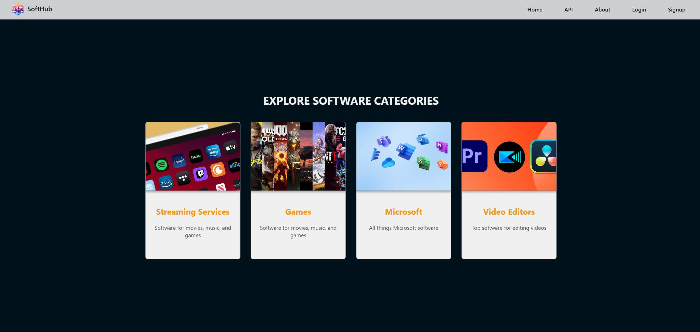
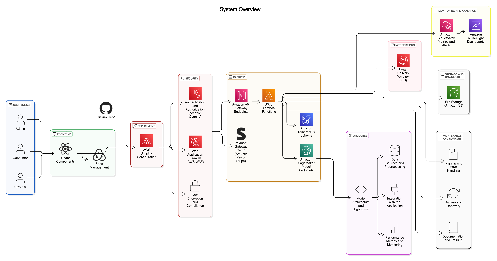
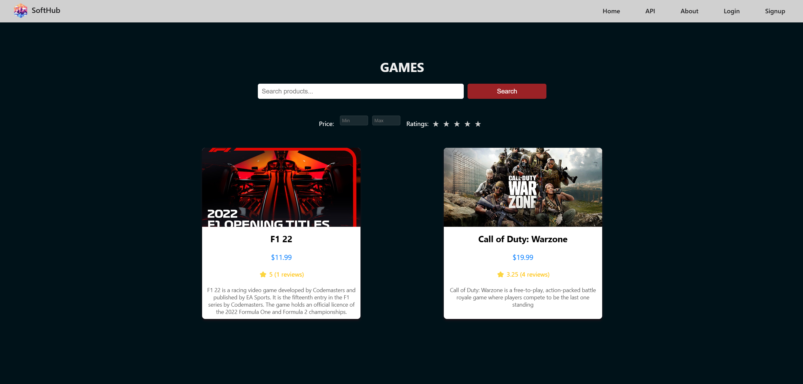
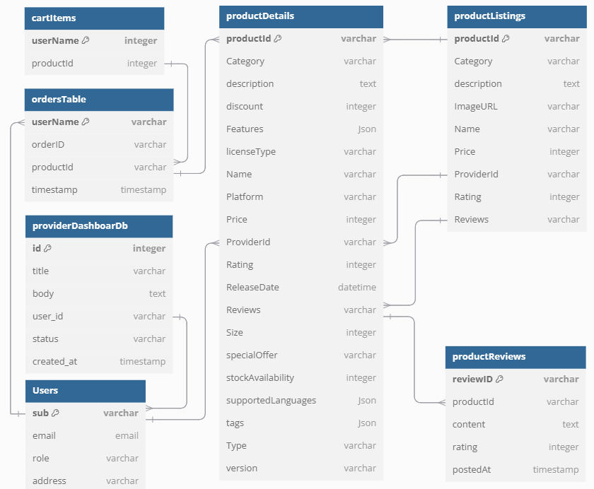
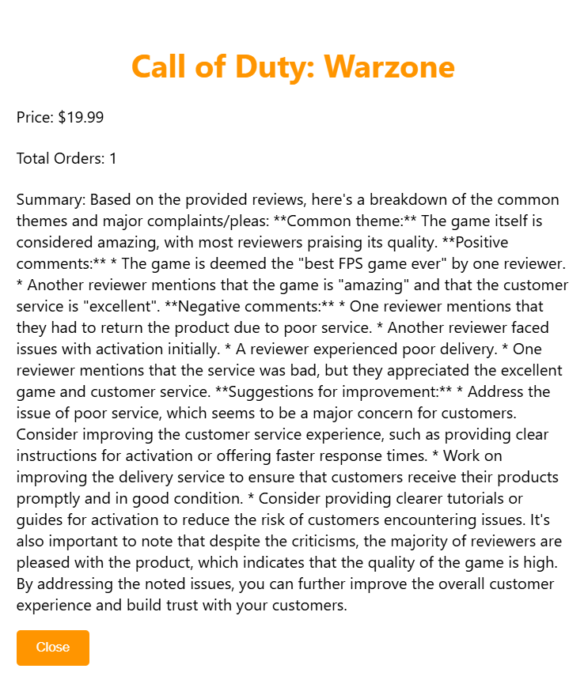
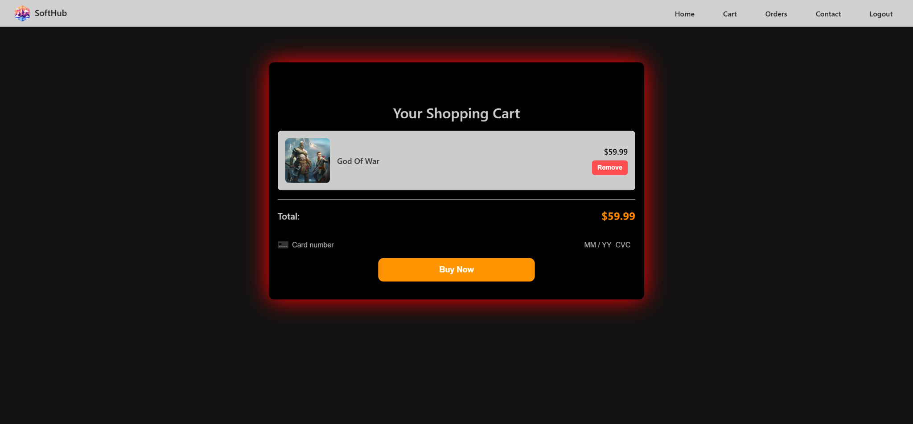

# SoftHub

## Overview
SoftHub is a cloud-hosted marketplace for software and subscription services, designed to connect providers and consumers through a secure and AI-enhanced platform. The marketplace enables software providers to list their products, analyze performance metrics, and gain customer insights. Consumers benefit from AI-powered review summaries, sentiment analysis, personalized recommendations, and secure transactions.

## Features
- **Product Listings:** Software providers can list their products with descriptions, prices, and relevant details.
- **AI-Powered Review Summaries:** Consumers can access summarized user reviews and sentiment analysis for informed purchasing decisions.
- **Personalized Recommendations:** The platform dynamically suggests relevant software based on user behavior.
- **Secure Payments:** Payments are processed securely through Stripe, with activation codes and installer files automatically delivered via email.
- **User Authentication:** AWS Cognito ensures secure access control for both providers and consumers.
- **Performance Analytics:** Providers gain insights into customer sentiment, sales trends, and software performance.
- **Admin Monitoring:** Platform activity can be monitored to ensure smooth operations.

  

## Architecture
SoftHub follows a microservices-based, cloud-native architecture using AWS services for scalability, security, and high availability.

- **Frontend:** React-based UI for seamless browsing and transactions.
- **Backend:** AWS Lambda functions managing authentication, transactions, and product listings.
- **Database:** Amazon DynamoDB for storing product details, user data, and reviews.
- **AI Integration:** Llama 8B for sentiment analysis and review summarization, hosted on AWS SageMaker.
- **Payment System:** Secure payment processing via Stripe, integrated with AWS SES for email confirmations.
- **Security:** AWS Cognito for authentication, SSL/TLS for encrypted data transmission.
- **Monitoring & Analytics:** AWS CloudWatch for tracking performance and QuickSight for analytics.

 

## Technical Implementation
### Frontend (React)
- Component-based architecture for a modular and scalable UI.
- React Router for seamless navigation.
- Axios for handling API requests.

 
 

### Backend (AWS Lambda & API Gateway)
- Serverless backend using AWS Lambda.
- API Gateway exposing RESTful APIs for frontend communication.
- Cognito for user authentication.

 

### Database (Amazon DynamoDB)
- High-availability NoSQL database for quick data access.
- Optimized schema design for fast querying.

 

### AI Integration (Llama 8B & SageMaker)
- AI models for sentiment analysis and review summarization.
- Real-time review insights for consumers.

 

### Payment Integration (Stripe & AWS SES)
- Secure transactions using Stripe API.
- Automated email delivery of activation codes via AWS SES.

 

## Lessons Learned
- **Efficient Cloud Resource Management:** Optimizing AWS services reduced costs and improved performance.
- **Standardized Naming Conventions:** A unified approach to naming database keys and APIs improved maintainability.
- **CI/CD Integration:** Automating deployments streamlined the development process.

## Future Enhancements
- **Docker Implementation:** Improve CI/CD workflows for better deployment automation.
- **Mobile App Development:** Extend SoftHub's features to mobile platforms.
- **Advanced Analytics:** Enhance provider dashboards with real-time sales trends and customer behavior analysis.

## Links
- **Live Marketplace:** [SoftHub Marketplace](https://main.duvnntlhsen54.amplifyapp.com/)
- **GitHub Repository:** [SoftHub on GitHub](https://github.com/BalajiRavindaran/COEN6313)
